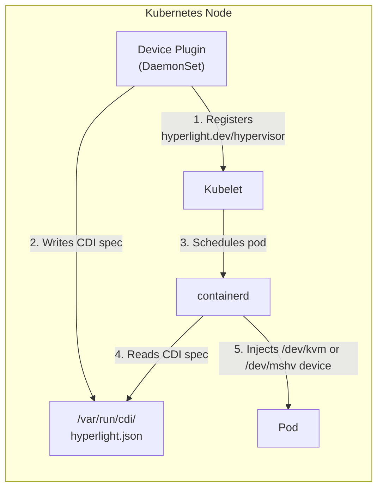

# Hyperlight on Kubernetes

Run [Hyperlight](https://github.com/hyperlight-dev/hyperlight) sandboxes in Kubernetes **without privileged containers**.

## Quick Start

| Target | Commands |
|--------|----------|
| **Local (KIND)** | `just local-up && just plugin-build && just plugin-local-push && just plugin-local-deploy` |
| **Azure (AKS)** | `just azure-up && just get-aks-credentials && just plugin-build && just plugin-acr-push && just plugin-azure-deploy` |

```bash
# Check status
just status

# View logs
just logs
```

## Verify Device Injection

Deploy a test pod to verify the hypervisor device is properly injected:

```bash
# Deploy test pod (after device plugin is running)
kubectl apply -f deploy/manifests/examples/test-pod-kvm.yaml

# Check it's running
kubectl get pod hyperlight-test-kvm

# View logs - should show /dev/kvm exists
kubectl logs hyperlight-test-kvm

# Cleanup
kubectl delete pod hyperlight-test-kvm
```

Expected output:
```
=== Hyperlight KVM Test Pod ===
Checking for /dev/kvm...
✓ /dev/kvm exists
crw-rw---- 1 nobody nobody 10, 232 Jan  6 12:00 /dev/kvm

Environment variables:
HYPERLIGHT_HYPERVISOR=kvm
HYPERLIGHT_DEVICE_PATH=/dev/kvm

=== Test Complete ===
```

## How It Works

A Kubernetes Device Plugin exposes hypervisor devices (`/dev/kvm` or `/dev/mshv`) to pods using the [Container Device Interface (CDI)](https://github.com/cncf-tags/container-device-interface). Pods request `hyperlight.dev/hypervisor` and get the device injected securely.



## Using Hyperlight in Your Pods

Request the `hyperlight.dev/hypervisor` resource and apply security best practices:

```yaml
apiVersion: v1
kind: Pod
metadata:
  name: my-hyperlight-app
spec:
  nodeSelector:
    hyperlight.dev/hypervisor: kvm  # or mshv
  automountServiceAccountToken: false
  securityContext:
    runAsNonRoot: true
    runAsUser: 65534
    seccompProfile:
      type: RuntimeDefault
  containers:
    - name: app
      image: your-hyperlight-app:latest
      resources:
        limits:
          hyperlight.dev/hypervisor: "1"
      securityContext:
        allowPrivilegeEscalation: false
        readOnlyRootFilesystem: true
        capabilities:
          drop: ["ALL"]
```

See [deploy/manifests/examples/](deploy/manifests/examples/) for complete examples.

## Example Hyperlight Application

The `hyperlight-app/` directory contains an example demonstrating best practices:

| Feature | Implementation |
|---------|----------------|
| **Minimal Image** | `scratch` base - just the binaries (~2.7MB) |
| **Static Binary** | musl libc, no runtime dependencies |
| **Non-root** | Runs as UID 65534 (nobody), no privilege escalation |
| **Read-only FS** | `readOnlyRootFilesystem: true` |
| **Seccomp** | `RuntimeDefault` profile |
| **No Capabilities** | All capabilities dropped |
| **No K8s API** | `automountServiceAccountToken: false` |
| **No Host Access** | hostNetwork/hostPID/hostIPC disabled |
| **Masked /proc** | `procMount: Default` |

```bash
# Build and deploy to AKS
just app-build && just app-acr-push && just app-azure-deploy

# View logs
kubectl logs -l app=hyperlight-hello -f
```

## Documentation

| Guide | Description |
|-------|-------------|
| [Command Reference](docs/commands.md) | All `just` commands explained |
| [Local Development](docs/local-development.md) | Test with KIND + local registry |
| [Azure Deployment](docs/azure-deployment.md) | Production on AKS + ACR |
| [GHCR Publishing](docs/ghcr-publishing.md) | Publish images to GitHub |
| [Architecture](docs/architecture.md) | How the device plugin works |

## Project Structure

```
.
├── device-plugin/           # Device plugin source code
│   ├── main.go              # Plugin implementation
│   └── Dockerfile
├── hyperlight-app/          # Example Hyperlight application
│   ├── host/                # Host binary (runs in container)
│   ├── guest/               # Guest binary (runs in VM)
│   ├── k8s/                 # App deployment manifests
│   └── Dockerfile           # Multi-stage build (scratch)
├── deploy/
│   ├── manifests/           # Production Kubernetes manifests
│   │   ├── device-plugin.yaml
│   │   └── examples/        # Test pods and deployments
│   ├── local/               # KIND-specific manifests and setup
│   │   ├── setup.sh
│   │   ├── teardown.sh
│   │   └── device-plugin.yaml
│   └── azure/               # Azure deployment
│       ├── setup.sh
│       ├── teardown.sh
│       └── config.env
├── docs/                    # Documentation
├── scripts/                 # Build and test scripts
└── justfile                 # Build/deploy commands
```

## Available Commands

```bash
just --list                  # Show all commands

# Device Plugin
just plugin-build            # Build binary + image
just plugin-local-push       # Push to local registry
just plugin-local-deploy     # Deploy to KIND
just plugin-acr-push         # Push to Azure Container Registry
just plugin-azure-deploy     # Deploy to AKS
just plugin-ghcr-push        # Push to ghcr.io/hyperlight-dev

# Example Hyperlight App
just app-build               # Build app (scratch image)
just app-local-deploy        # Deploy to KIND
just app-azure-deploy        # Deploy to AKS

# Cluster Management
just local-up                # Create KIND cluster + registry
just local-down              # Tear down KIND
just azure-up                # Create Azure infrastructure
just azure-stop              # Stop AKS cluster 
just azure-start             # Start AKS cluster
just azure-down              # Delete all Azure resources

# Utilities
just status                  # Show device plugin status
just logs                    # View device plugin logs
just check                   # Verify prerequisites
```

## Requirements

### Platform

| OS | Support | Notes |
|----|---------|-------|
| **Linux** | ✅ Full | Native support |
| **Windows** | ✅ Via WSL2 | Run everything inside WSL2 (Ubuntu recommended) |

> **Windows users:** Install [WSL2](https://learn.microsoft.com/en-us/windows/wsl/install) first, then work entirely inside WSL2. Docker Desktop should be configured to use WSL2 backend.
>
> ```powershell
> # PowerShell (as admin)
> wsl --install -d Ubuntu
> ```
>
> Then open Ubuntu and continue from there.

### All targets

| Tool | Purpose | Install |
|------|---------|---------|
| [just](https://github.com/casey/just) | Command runner | `cargo install just` or [binaries](https://github.com/casey/just/releases) |
| [Docker](https://docs.docker.com/get-docker/) | Build images | See Docker docs (use WSL2 backend on Windows) |
| [kubectl](https://kubernetes.io/docs/tasks/tools/) | Kubernetes CLI | `curl -LO "https://dl.k8s.io/release/$(curl -L -s https://dl.k8s.io/release/stable.txt)/bin/linux/amd64/kubectl"` |
| [Go](https://go.dev/dl/) 1.21+ | Device plugin | `apt install golang` or download |
| [envsubst](https://www.gnu.org/software/gettext/) | Template substitution | `apt install gettext-base` (usually pre-installed) |

### Local development (KIND)

| Tool | Purpose | Install |
|------|---------|---------|
| [KIND](https://kind.sigs.k8s.io/) 0.20+ | Local K8s | `go install sigs.k8s.io/kind@latest` |
| `/dev/kvm` | Hypervisor | See below |

> **Minimum versions:** Kubernetes 1.26+, KIND 0.20+. Older versions may have container runtime issues.

### Azure deployment

| Tool | Purpose | Install |
|------|---------|---------|
| [Azure CLI](https://docs.microsoft.com/en-us/cli/azure/install-azure-cli) | Azure management | `curl -sL https://aka.ms/InstallAzureCLIDeb \| sudo bash` |

### Building Hyperlight apps (optional)

| Tool | Purpose | Install |
|------|---------|---------|
| [Rust](https://rustup.rs/) | Hyperlight apps | `curl --proto '=https' --tlsv1.2 -sSf https://sh.rustup.rs \| sh` |
| cargo-hyperlight | Guest binaries | `cargo install --locked cargo-hyperlight` |

> **Note:** Rust is only needed if you're building Hyperlight applications locally. The example app builds inside Docker, so Rust isn't required on your host machine.

## License

Apache 2.0
c