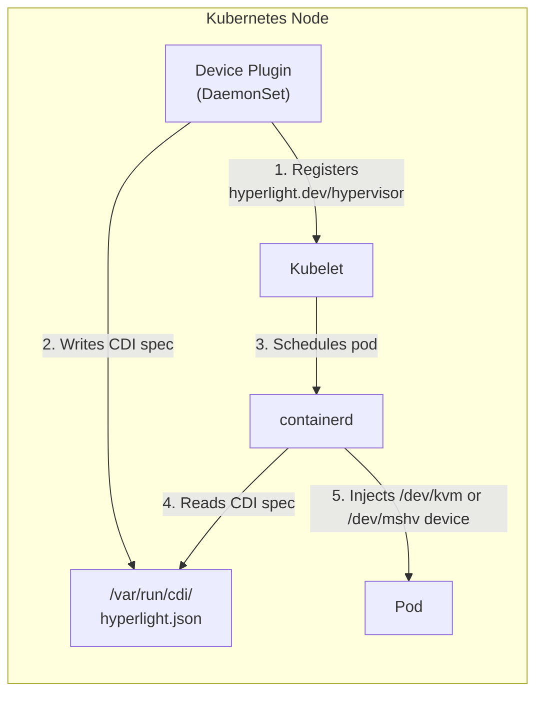

# Architecture

How the Hyperlight Device Plugin works.

## Overview

The device plugin enables Hyperlight sandboxes to run in Kubernetes **without privileged containers** by:

1. Detecting available hypervisor devices (`/dev/kvm` or `/dev/mshv`)
2. Registering them as schedulable resources with kubelet
3. Using CDI to inject devices into containers at runtime



## Device Plugin API

The plugin implements the Kubernetes Device Plugin API:

### Registration

On startup, the plugin:
1. Detects `/dev/mshv` or `/dev/kvm` on the node
2. Connects to kubelet at `/var/lib/kubelet/device-plugins/kubelet.sock`
3. Registers the `hyperlight.dev/hypervisor` resource

### ListAndWatch

Reports device health to kubelet:
- Sends initial device list on startup
- Runs a health check every 30 seconds (required by the API, though the device shouldn't disappear in practice)
- Kubelet updates node capacity accordingly

### Allocate

When a pod requests `hyperlight.dev/hypervisor`:
1. Kubelet calls the plugin's `Allocate()` method
2. Plugin returns a CDI device reference
3. containerd reads the CDI spec and mounts the device

## CDI (Container Device Interface)

CDI is a standard for declaratively specifying device injection.

### CDI Spec

Written to `/var/run/cdi/hyperlight.json`:

```json
{
  "cdiVersion": "0.6.0",
  "kind": "hyperlight.dev/hypervisor",
  "devices": [
    {
      "name": "kvm",
      "containerEdits": {
        "deviceNodes": [
          {
            "path": "/dev/kvm",
            "type": "c",
            "permissions": "rw",
            "uid": 65534,
            "gid": 65534
          }
        ],
        "env": [
          "HYPERLIGHT_HYPERVISOR=kvm", // or mshv
          "HYPERLIGHT_DEVICE_PATH=/dev/kvm" // or /dev/mshv
        ]
      }
    }
  ]
}
```

### Device Injection

When containerd creates a container:
1. Reads the CDI spec
2. Creates `/dev/kvm` (or `/dev/mshv`) device node inside container
3. Sets uid/gid to match the configured values (default: 65534/nobody)
4. Sets environment variables

**No privileged mode required!**

## Device Count

The plugin advertises multiple "devices" (default: 2000 per node), but there's only one physical hypervisor device.

### Why?

The Kubernetes Device Plugin API was designed for discrete hardware (GPUs, NICs). But `/dev/kvm` and `/dev/mshv` are **shared** - they can serve thousands of concurrent VMs.

We use the "count" pattern (same as [generic-device-plugin](https://github.com/squat/generic-device-plugin) uses for `/dev/fuse`):

| What it means | What it's NOT |
|---------------|---------------|
| Concurrent allocations allowed | Physical device count |
| Scheduling limit | Hard VM limit |
| "Slots" on this node | Unique devices |

### Configuration

Set via environment variables in the device plugin DaemonSet:

```yaml
env:
  - name: DEVICE_COUNT
    value: "5000"  # Increase for high-density nodes
  - name: DEVICE_UID
    value: "65534"  # UID for device node inside containers (nobody)
  - name: DEVICE_GID
    value: "65534"  # GID for device node inside containers (nobody)
```

| Variable | Default | Description |
|----------|---------|-------------|
| `DEVICE_COUNT` | `2000` | Number of concurrent allocations per node |
| `DEVICE_UID` | `65534` | UID for the device node in containers (nobody) |
| `DEVICE_GID` | `65534` | GID for the device node in containers (nobody) |

> **Note:** The `DEVICE_UID` and `DEVICE_GID` should match the user your pods run as. If your pods use `runAsUser: 65534` (nobody), set `DEVICE_UID=65534` and `DEVICE_GID=65534`.

| Hypervisor | Recommended Count | Notes |
|------------|-------------------|-------|
| KVM | 2000+ | Limited by node memory/CPU, not KVM |
| MSHV | ~2000 | Microsoft Hypervisor has limits per node |

## Security Model

Hyperlight workloads run with **minimal privileges**:

### Pod Security Context

```yaml
securityContext:
  runAsNonRoot: true
  runAsUser: 65534
  runAsGroup: 65534
  seccompProfile:
    type: RuntimeDefault
```

### Container Security Context

```yaml
securityContext:
  allowPrivilegeEscalation: false
  readOnlyRootFilesystem: true
  capabilities:
    drop:
      - ALL
```

### Device Ownership

The CDI spec sets device uid/gid to match the container user:

```json
"uid": 65534,
"gid": 65534
```

This allows the non-root container process to access the hypervisor device.

## RuntimeClasses

Two RuntimeClasses route pods to appropriate node pools:

| RuntimeClass | Hypervisor | Node Selector | Toleration |
|--------------|------------|---------------|------------|
| `hyperlight-kvm` | KVM | `hyperlight.dev/hypervisor=kvm` | `hyperlight.dev/hypervisor=kvm:NoSchedule` |
| `hyperlight-mshv` | MSHV | `hyperlight.dev/hypervisor=mshv` | `hyperlight.dev/hypervisor=mshv:NoSchedule` |

Usage:
```yaml
spec:
  runtimeClassName: hyperlight-kvm
```

## Node Labels and Taints

### Labels

| Label | Values | Purpose |
|-------|--------|---------|
| `hyperlight.dev/enabled` | `true` | Device plugin runs on this node |
| `hyperlight.dev/hypervisor` | `kvm` or `mshv` | Which hypervisor is available |

### Taints

| Taint | Effect | Purpose |
|-------|--------|---------|
| `hyperlight.dev/hypervisor=kvm:NoSchedule` | NoSchedule | Only Hyperlight workloads on KVM nodes |
| `hyperlight.dev/hypervisor=mshv:NoSchedule` | NoSchedule | Only Hyperlight workloads on MSHV nodes |

## Next Steps

- [Local Development](local-development.md) - Test locally with KIND
- [Azure Deployment](azure-deployment.md) - Deploy to AKS
- [GHCR Publishing](ghcr-publishing.md) - Publish images publicly
